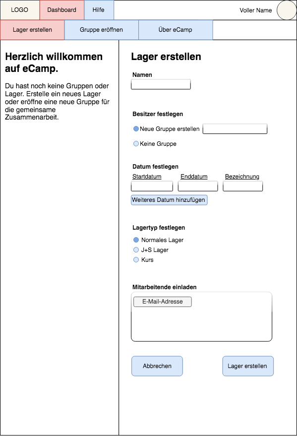
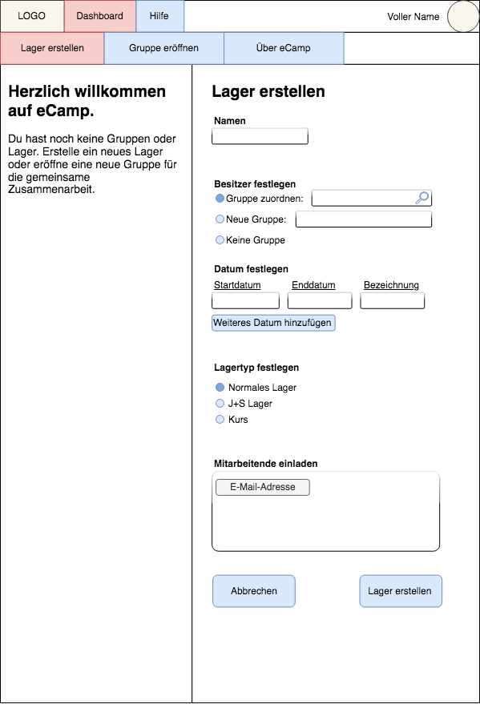

# Use Cases
Legende für die Bilder:
Blau: Aktion
Rot: Aktiv
Violett: Disabled


#### ```UC 01``` Neuregistrierter Benutzer ohne Einladung 
 _(Prio 10)_  
 Dem Benutzer wird die Über eCamp Seite angezeigt.
 - Lager erstellen  
 - Gruppe erstellen  
 - Hilfe anschauen  
 
   
 
---
#### ```UC 02``` Neues Camp erstellen
 _(Prio 10)_  
  Name, Gruppe, Zeit (Perioden), CampType (Lager oder Kurs), Mitarbeitende.  

##### ```UC 02.1``` Benutzer hat noch keine Gruppe
 Wenn der Benutzer noch keine Gruppe hat, 
 kann er hier eine Gruppe mit dem Namen erstellen. 
 Diese wird automatisch in die versteckte Übergruppe "Benutzer" erstellt.
  
 
##### ```UC 02.2``` Benutzer hat bereits mind. eine Gruppe
 Wenn der Benutzer bereits eine Gruppe hat, dann
 wird automatisch die ausgewählte Gruppe ausgewählt.
   
 
##### ```UC 02.3``` Benutzer kommt via Gruppenview auf diesen Flow
 (Falls der Benutzer bereits eine vorgegebene Struktur hat (MiData / Hitobito / …))  
 Hier kann der Benutzer die Gruppe nicht auswählen,
 es wird ihm einfach angezeit, in welcher Gruppe 
 das Lager kreiert wird.
 
---
#### ```UC 03``` Camp finden und öffnen.
 _(Prio 7)_  
 
 
---
#### ```UC 04``` Anderen User zu Camp einladen.
 _(Prio 9)_  
 Bekannte User / unbekannte User aus Sicht eCamp-Datenbank. 
 
  
---
#### ```UC 05``` Camp-Einladung annehmen oder ablehnen.
 _(Prio 8.9)_  
 
  
---
#### ```UC 06``` Camp-Einstellungen vornehmen.
 _(Prio 6)_  
 Z.B. Kopfdaten vom Camp (Ort, Name, Motto, …), Perioden, Event-Kategorien (LS / LA / LP / …).
 
  
---
#### ```UC 07``` Event (Block im DP) erstellen.
 _(Prio 9)_  
 0 Event-Instanzen (möglich? nötig? in v2 gibt es Lagerleiter welche einen Block ganz am Anfang des ersten Tages für Lagerregeln etc. “missbrauchen”), 1 Event-Instanz, mehrere Event-Instanzen.
 
  
---
#### ```UC 08``` Event im Lager einplanen.  
 _(Prio 9)_  
 Derselbe Block mit demselben DP kann an mehreren Orten im Lager eingefügt werden. Events können im Lager verschoben werden. Events können zeitlich gleichzeitig stattfinden (Buebe / Meitli, Wölfli / Pfadi, Quali-Höck / Programm).
  
  
---
#### ```UC 09``` Event-Inhalt bearbeiten.
 _(Prio 8)_  
 Block-Kopfdaten bearbeiten (Name und Category), Plugin-Instanz hinzufügen (z.B. wenn auf dem Lager definiert ist dass ein LS mehrere SiKos haben kann, Winter, Berg, Wasser), Plugin-Instanz bearbeiten, Plugin-Instanz entfernen.
 
  
---
#### ```UC 10``` Event kopieren.
 _(Prio 5)_  
 Innerhalb Lager und Lager-übergreifend. 
 
  
---
#### ```UC 11``` Tagesübersicht ansehen.
 _(Prio 8)_  
 
  
---
#### ```UC 12``` Wochenübersicht ansehen.
 _(Prio 8)_  
 
  
---
#### ```UC 13``` Lager-Materiallisten ansehen.
 _(Prio 5)_  
 
  
---
#### ```UC 14``` Drucken / Offline verfügbar.
 _(Prio 7)_  
 Wie kommt der User zu seinem gewünschten Ausdruck. NICHT: Wie sieht der Ausdruck aus. Prio 7
